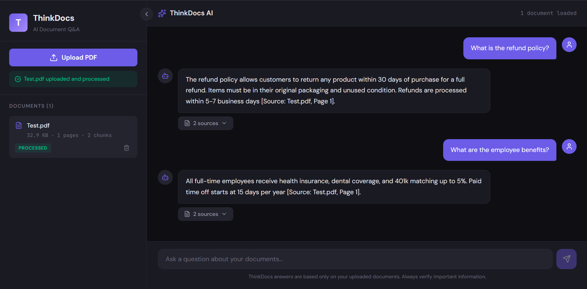
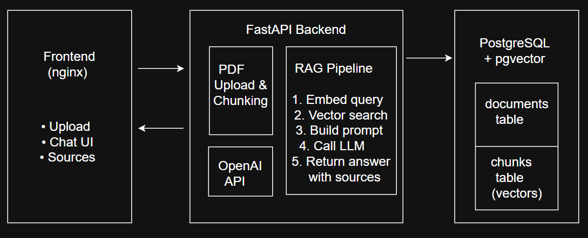

# ThinkDocs

**AI-Powered Document Q&A Platform**

ThinkDocs is a RAG (Retrieval-Augmented Generation) application that lets users upload PDF documents and ask natural language questions about their content. The system retrieves the most relevant sections from the uploaded documents and generates accurate, cited answers using GPT-4o-mini.



---

## Features

- **PDF Upload & Processing** — Upload PDFs that are automatically parsed, chunked, and embedded
- **Semantic Search** — Questions are matched to relevant document sections using vector similarity (not keyword matching)
- **AI-Generated Answers** — GPT-4o-mini generates responses grounded only in the uploaded documents
- **Source Citations** — Every answer includes citations with document name, page number, and relevance score
- **Hallucination Control** — The system refuses to answer when documents don't contain relevant information
- **Full Stack Containerization** — Single-command deployment with Docker Compose

---

## Architecture



---

### RAG Pipeline Flow

1. **Upload** — PDF is parsed with PyMuPDF, split into sentence-aware overlapping chunks (~500 chars)
2. **Embed** — Each chunk is converted to a 1536-dimensional vector using OpenAI's text-embedding-ada-002
3. **Store** — Chunks and embeddings are stored in PostgreSQL with pgvector
4. **Query** — User's question is embedded using the same model
5. **Retrieve** — pgvector finds the top-5 most similar chunks via cosine similarity
6. **Generate** — Retrieved chunks are injected into a prompt, and GPT-4o-mini generates a cited answer

---

## Tech Stack

| Layer | Technology | Purpose |
|-------|-----------|---------|
| Frontend | React, CSS | Upload interface, chat UI, source citation display |
| Backend | Python, FastAPI | REST API, PDF processing, RAG pipeline orchestration |
| Database | PostgreSQL + pgvector | Document metadata, text chunks, vector embeddings |
| AI/LLM | OpenAI API (GPT-4o-mini, ada-002) | Embeddings and answer generation |
| Infrastructure | Docker, Docker Compose, nginx | Containerization and reverse proxy |

---

## Project Structure

```
thinkdocs/
├── backend/
│   ├── app/
│   │   ├── main.py                  # FastAPI entry point
│   │   ├── config.py                # Environment configuration
│   │   ├── database.py              # PostgreSQL connection pool
│   │   ├── routers/
│   │   │   ├── documents.py         # Upload, list, delete endpoints
│   │   │   └── chat.py              # Q&A and retrieval endpoints
│   │   ├── services/
│   │   │   ├── pdf_service.py       # PDF extraction & sentence-aware chunking
│   │   │   ├── embedding_service.py # OpenAI embedding API integration
│   │   │   ├── document_service.py  # Upload orchestration
│   │   │   └── rag_service.py       # RAG pipeline & prompt engineering
│   │   ├── repositories/
│   │   │   ├── document_repository.py # Document table queries
│   │   │   └── chunk_repository.py    # Chunk & vector similarity queries
│   │   └── models/
│   │       ├── document_models.py   # Pydantic response models
│   │       └── chat_models.py       # Q&A request/response models
│   ├── Dockerfile
│   └── requirements.txt
├── frontend/
│   ├── src/
│   │   ├── App.js                   # Root component
│   │   ├── api.js                   # Backend API communication
│   │   └── components/
│   │       ├── Sidebar.js           # Document upload & management
│   │       └── ChatPanel.js         # Chat interface & source citations
│   ├── Dockerfile
│   └── nginx.conf                   # Reverse proxy configuration
├── docker-compose.yml               # Full stack orchestration
└── README.md
```

---

## Getting Started

### Prerequisites

- [Docker Desktop](https://www.docker.com/products/docker-desktop/) installed and running
- [OpenAI API key](https://platform.openai.com/api-keys) with billing enabled (~$1–5 for full project usage)

### Quick Start (Docker Compose)

1. **Clone the repository**
   ```bash
   git clone https://github.com/GauravJ012/ThinkDocs.git
   cd ThinkDocs
   ```

2. **Create a `.env` file** in the project root:
   ```
   OPENAI_API_KEY=sk-proj-your-api-key-here
   ```

3. **Start the application**
   ```bash
   docker compose up --build
   ```

4. **Open the app** at [http://localhost:3000](http://localhost:3000)

5. **Upload a PDF** and start asking questions!

### Local Development

<details>
<summary>Click to expand local development setup</summary>

**Start PostgreSQL:**
```bash
docker compose up db -d
```

**Backend:**
```bash
cd backend
python -m venv venv
source venv/bin/activate  # Windows: venv\Scripts\activate
pip install -r requirements.txt
# Create backend/.env with DB credentials and OPENAI_API_KEY
uvicorn app.main:app --reload
```

**Frontend:**
```bash
cd frontend
npm install
npm start
```

Backend runs at `http://localhost:8000`, frontend at `http://localhost:3000`.

</details>

---

## API Endpoints

| Method | Endpoint | Description |
|--------|----------|-------------|
| `POST` | `/api/documents` | Upload a PDF document |
| `GET` | `/api/documents` | List all uploaded documents |
| `GET` | `/api/documents/{id}` | Get document details |
| `DELETE` | `/api/documents/{id}` | Delete a document and its chunks |
| `POST` | `/api/chat/ask` | Ask a question (full RAG pipeline) |
| `POST` | `/api/chat/retrieve` | Retrieve relevant chunks (debug) |
| `GET` | `/health` | Health check |

Full interactive API documentation available at `http://localhost:8000/docs` (Swagger UI).

---

## Key Design Decisions

**Sentence-aware chunking over character-based splitting** — Text is split into sentences first, then sentences are grouped into ~500 character chunks with overlap built from trailing sentences. This ensures no chunk starts or ends mid-sentence, producing cleaner embeddings.

**pgvector over dedicated vector databases** — PostgreSQL with pgvector stores both relational data and vector embeddings in a single database, reducing infrastructure complexity. IVFFlat indexing provides fast approximate nearest-neighbor search.

**Prompt engineering for hallucination control** — The system prompt explicitly instructs the LLM to answer only from provided context, read all sources before responding, and cite specific documents and pages. Out-of-context questions receive an "insufficient information" response instead of fabricated answers.

**Multi-stage Docker builds** — The frontend Dockerfile uses a two-stage build: Node.js compiles the React app, then only the built static files are copied into a lightweight nginx image (~25MB vs ~500MB).

---

## License

This project is built for educational and portfolio purposes.
